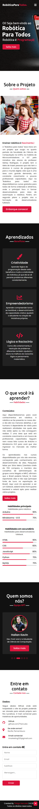

<h2><b>ProjetoRoboticaParaTodos</b><h2>

 2021, Thiago Hercules. All rights reserved.  

• Link to application deploy in vercel:  
    ↳ https://projeto-robotica-para-todos.vercel.app/   

 <b>Application Content</b>  
  
• Responsive menu / Navbar  
    ↳ Home.  
     ↳ Sobre (About).  
      ↳ Aprendizados (Learnings).  
      ↳ Habilidades (Habilities).  
       ↳ Time (Team).  
        ↳ Contato (Contact).  

<h3><em>• Full screenshot of the website. // Print completo do website. </h3>
 </img> 
 
<h3><em>• Full screenshot of the website in responsive mode. // Print completo do website em modo responsivo. </h3>
 </img> 
 

<h3><b> <em>🗃️ About project: </em> </b> </h3>

 • Robotics for everyone started as a project that emerged in the fourth period of the Computer Science college at UniFG, in the subject Microcontrollers and IOT by the initiative of professor Sidney Rodrigues' students. The project has the idea of bringing people who don't have the reach to programming courses to the digital world, since it is an area with great demand, in constant growth, and few qualified professionals.  Here at Robotica for everyone we make free courses available for everyone in an orderly and dynamic way, where the main focus is to train developers for the automation and robotics area. However, in second plan the project aims to train fullstack developers. 
  

 • A Robótica para todos teve início em um projeto que surgiu no quarto período da faculdade de Ciência da Computação na UniFG, na matéria de Microcontroladores e IOT pela iniciativa dos alunos do professor Sidney Rodrigues. O projeto tem a ideia de trazer pessoas que não tem o alcance à cursos de programação para o mundo digital, visto que é uma área com grande demanda, em constante crescimento e poucos profissionais capacitados.  Aqui na Robótica para todos nós disponibilizamos cursos gratuitos para todos de forma ordenada e dinâmica, onde o principal foco é formar desenvolvedores para área de automação e robótica. Porém, em segundo plano o projeto visa a formação de desenvolvedores fullstack. 

 

<em><b>Languages:</b></em> 

 

<em><b>I.D.E:</b></em> 

 

<h1><b>Hello, my name is Thiago Hercules 👋</b><i class="fas fa-code"></i></h1>

<em>Jr. fullstack developer. | Freelancer Designer. </em>

<h3><em><b>🌍About me:🧠</b></em></h3> 

 Hello, my name is Thiago Hercules, I'm 19 years old and I'm a 4th period Computer Science student at UNIFG. My main goal is to become a fullstack developer. I have knowledge in all programming STACKS, with emphasis on Java back-end. My studies in programming go back to the year 2016 with the beginning of the Java Academy at fuctura tecnology and continue until today with the present trainings and developed projects. As I studied in a reference school, I was introduced to robotics and IOT development early on, where I participated in the Brazilian Robotics Olympiad (OBR) in 2018 and in the official LEGO FLL (First Lego League) tournament in the Hydro Dinamics version in 2017. Recently in the year 2021 I joined as dev. manager at jupiter consulting, acting as leader of a development team and coagulating with my personal projects.

  

 

<h3><em><b> 🔹 I programming in: 🎓</b></em></h3> 

 

 

<h3><em><b> 🔹 Languages of i need to improve myself: 😬</b></em></h3>

 

<h3><em><b> 🔹 I am interested in: 🧐</em><b></h3> 

	
<h3><em><b> 🔶 About BootCamps: 🚀</em><b></h3> 

 --> Bootcamp developer mobile | IGTI | 4/5 ✅ 

